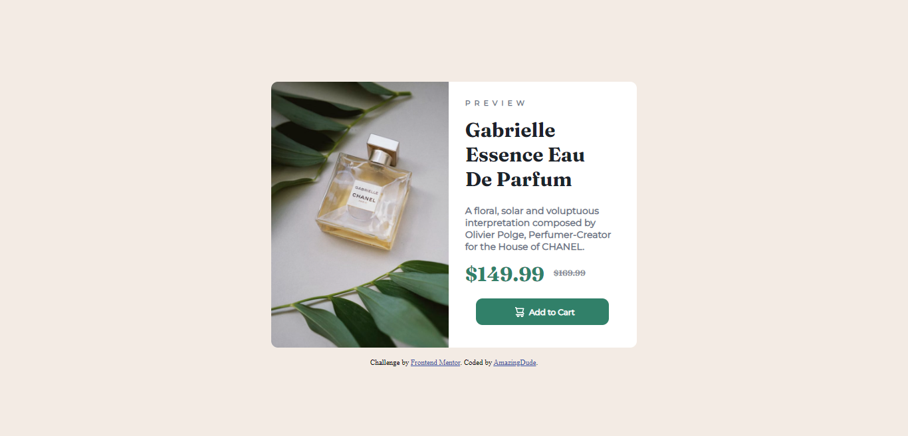

# Frontend Mentor - Product preview card component solution

This is a solution to the [Product preview card component challenge on Frontend Mentor](https://www.frontendmentor.io/challenges/product-preview-card-component-GO7UmttRfa). Frontend Mentor challenges help you improve your coding skills by building realistic projects. 

## Table of contents

- [Overview](#overview)
  - [The challenge](#the-challenge)
  - [Screenshot](#screenshot)
  - [Links](#links)
- [My process](#my-process)
  - [Built with](#built-with)
  - [What I learned](#what-i-learned)
  - [Continued development](#continued-development)
  - [Useful resources](#useful-resources)
- [Author](#author)

## Overview

### The challenge

Users should be able to:

- View the optimal layout depending on their device's screen size
- See hover and focus states for interactive elements

### Screenshot

### Links

- Live Site URL:(https://illustrious-tiramisu-6f7e8d.netlify.app/)

## My process

### Built with

- Semantic HTML5 markup
- CSS custom properties
- Flexbox
- Desktop-first workflow

### What I learned

With the help of this challenge I was able to learn how to use flexbox and other css properties practically.

### Continued development

I want to continue focusing on responsive design and media queries.

### Useful resources

- [Resource 1](https://w3schools.com/css) - This helped me for understanding different concepts. I really liked this pattern and will use it going forward whenever I need it.
- [Resource 2](https://www.codecademy.com) - This website helped me a lot as a beginner to learn html and css for free. I'd recommend it to anyone starting as a beginner.

## Author

- Frontend Mentor - [@AmazingDude](https://www.frontendmentor.io/profile/AmazingDude)
- Twitter - [@AmazingDudeFN](https://www.twitter.com/AmazingDudeFN)
